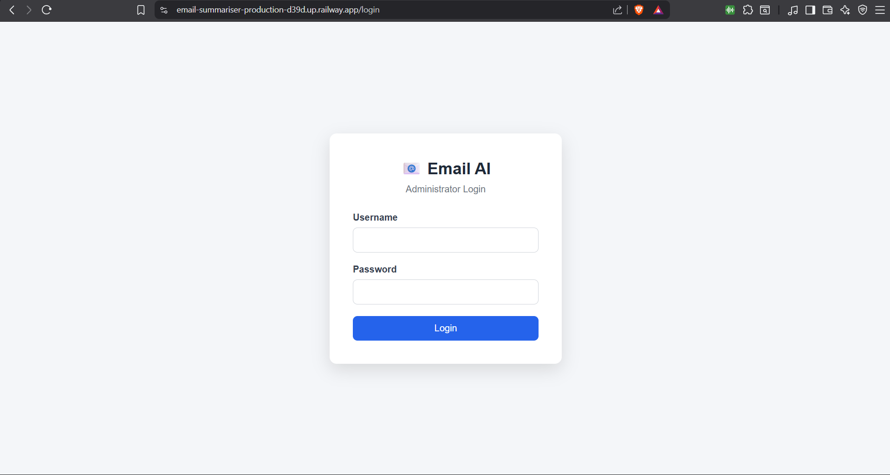
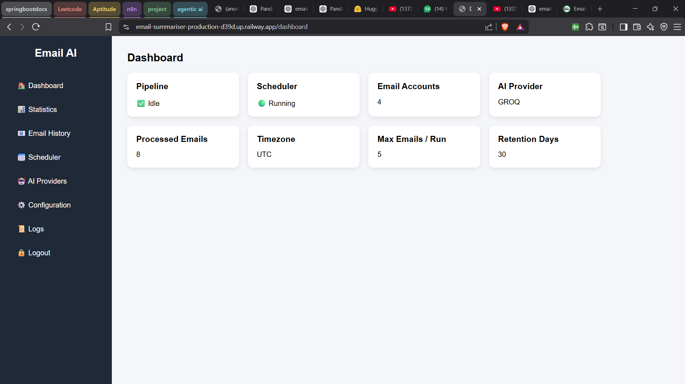
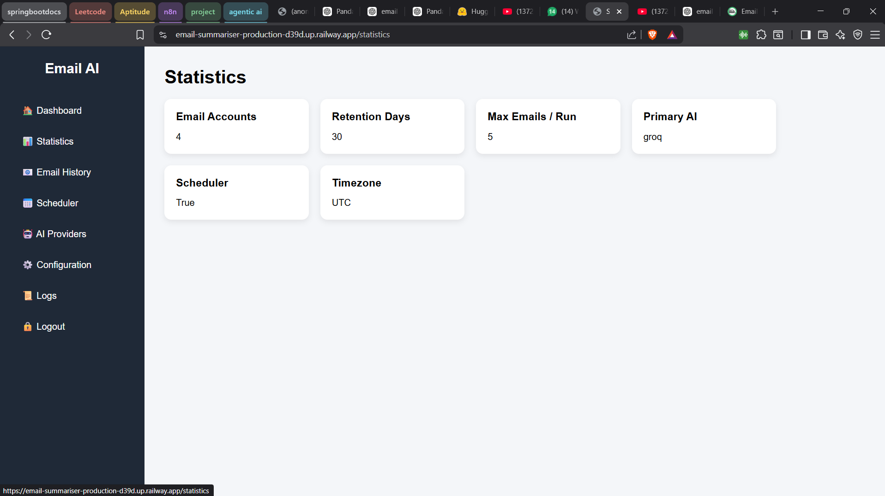
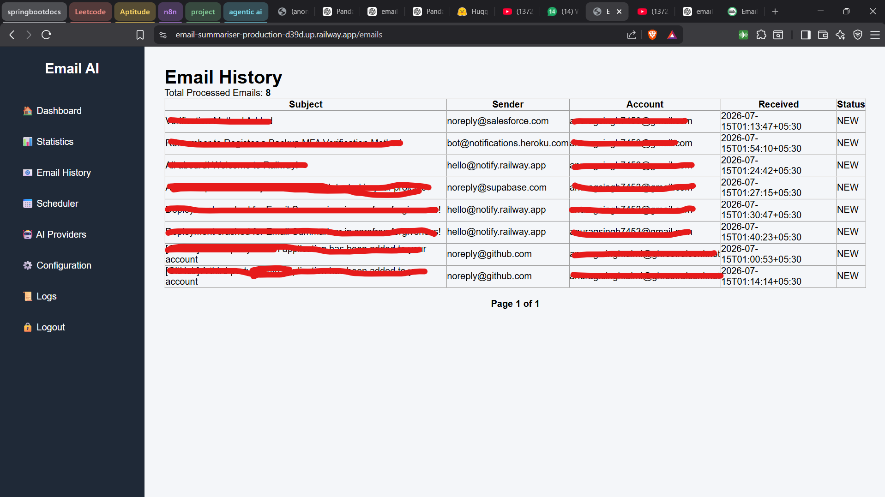
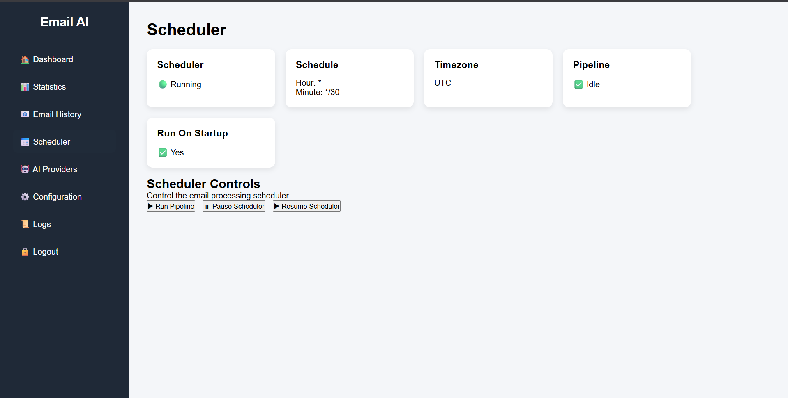
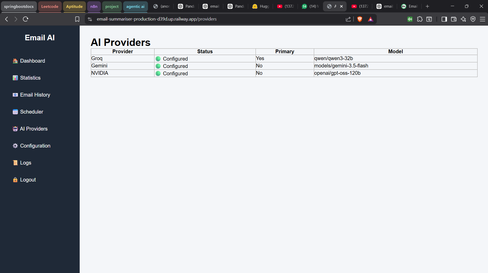
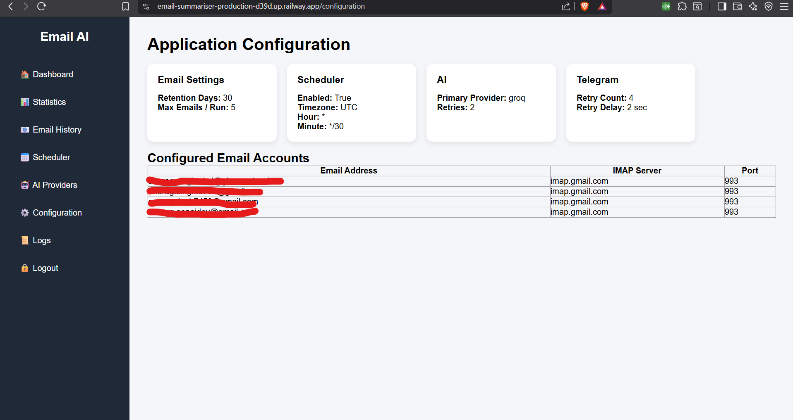
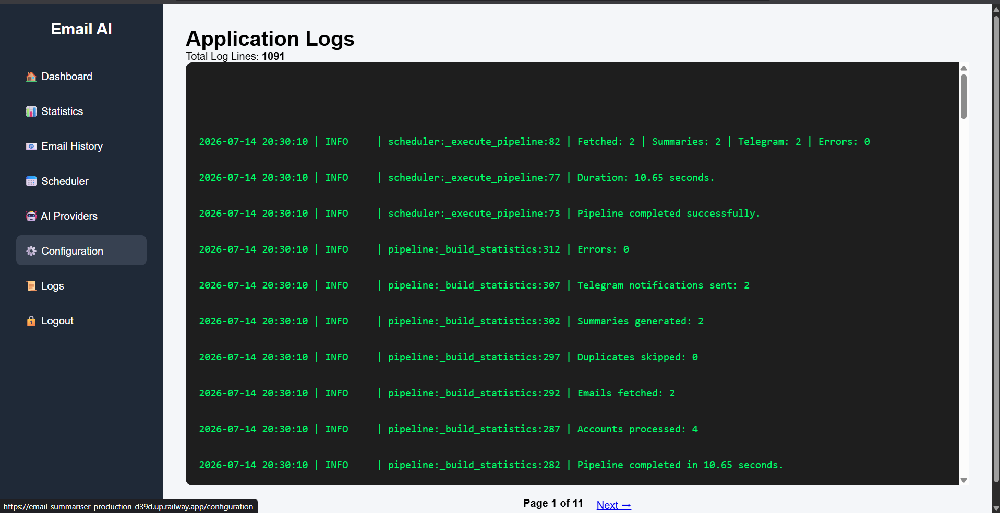
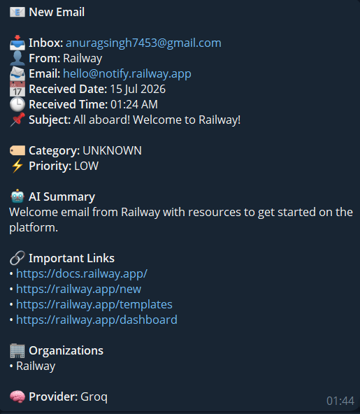

# 📧 Personal AI Email Summarizer

<p align="center">


</p>

A production-ready AI-powered email automation system that monitors multiple inboxes, summarizes emails using modern LLMs, stores processing history, and delivers beautifully formatted summaries directly to Telegram.

---

# 📸 Application Preview

## 🔐 Login



---

## 📊 Dashboard



---

## 📈 Statistics



---

## 📧 Email History



---

## ⏰ Scheduler



---

## 🤖 AI Providers



---

## ⚙️ Configuration



---

## 📝 Logs



---

## 📨 Telegram Notification



---

# ✨ Features

## 📥 Email Processing

- Multiple IMAP email accounts
- HTML & Plain Text parsing
- MIME decoding
- UTF-8 support
- Multipart email handling
- Duplicate email detection
- Automatic hourly polling

---

## 🤖 AI Summarization

Supports multiple providers:

- Google Gemini
- Groq
- NVIDIA NIM

Features

- Automatic provider selection
- Structured prompts
- Retry mechanism
- Configurable summary length

---

## 📨 Telegram Notifications

- Beautiful formatted messages
- Markdown support
- Retry mechanism
- Delivery confirmation
- Error handling

---

## 📊 Admin Dashboard

Built with **FastAPI + Jinja2**

Includes:

- Dashboard
- Email History
- Statistics
- Scheduler
- AI Providers
- Configuration Viewer
- Logs Viewer

---

## 🔐 Authentication

- Secure Admin Login
- Session Authentication
- Protected Routes
- Secret Key Based Sessions

---

## ⚙️ Scheduler

- APScheduler
- Automatic execution
- Manual pipeline execution
- Configurable schedule
- Startup execution support

---

## 💾 Database

SQLite persistence

Stores

- Processed emails
- Message IDs
- Processing timestamps
- Duplicate protection

---

## 📝 Logging

Powered by **Loguru**

Tracks

- Scheduler events
- Email processing
- AI requests
- Telegram delivery
- Errors
- Startup events

---

# 🛠 Tech Stack

| Category | Technology |
|-----------|------------|
| Language | Python 3.13 |
| Backend | FastAPI |
| Templates | Jinja2 |
| Scheduler | APScheduler |
| Database | SQLite |
| AI | Gemini, Groq, NVIDIA |
| Messaging | Telegram Bot API |
| Email | IMAP |
| Logging | Loguru |
| Deployment | Railway |

---

# 📂 Project Structure

```text
Email-Summariser/
│
├── admin/
│   ├── templates/
│   ├── app.py
│   ├── auth.py
│   ├── log_service.py
│   ├── routes.py
│   ├── schemas.py
│   └── state.py
│
├── ai/
│   ├── gemini.py
│   ├── groq.py
│   ├── nvidia.py
│   ├── base_provider.py
│   ├── prompts.py
│   ├── models.py
│   └── exceptions.py
│
├── database/
│   ├── connection.py
│   ├── repository.py
│   └── models.py
│
├── mail/
│   ├── parser.py
│   ├── reader.py
│   ├── models.py
│   └── exceptions.py
│
├── telegram/
│   ├── bot.py
│   ├── client.py
│   ├── formatter.py
│   ├── service.py
│   └── models.py
│
├── data/
├── logs/
├── tests/
├── testing/
│
├── config.py
├── scheduler.py
├── pipeline.py
├── pipeline_models.py
├── main.py
├── requirements.txt
├── README.md
├── .env
├── .env.example
└── .gitignore
```

---

# 🚀 Installation

Clone the repository

```bash
git clone https://github.com/<your-username>/Email-Summariser.git
```

Move into the project

```bash
cd Email-Summariser
```

Create a virtual environment

```bash
python -m venv .venv
```

Activate

### Windows

```powershell
.\.venv\Scripts\Activate.ps1
```

### Linux / macOS

```bash
source .venv/bin/activate
```

Install dependencies

```bash
pip install -r requirements.txt
```

---

# ⚙️ Configuration

Copy

```text
.env.example
```

to

```text
.env
```

Fill in the required values.

Example

```env
EMAIL_1=
EMAIL_1_PASSWORD=
EMAIL_1_IMAP_SERVER=
EMAIL_1_IMAP_PORT=

EMAIL_2=
EMAIL_2_PASSWORD=
EMAIL_2_IMAP_SERVER=
EMAIL_2_IMAP_PORT=

EMAIL_3=
EMAIL_3_PASSWORD=
EMAIL_3_IMAP_SERVER=
EMAIL_3_IMAP_PORT=

PRIMARY_AI_PROVIDER=groq

GROQ_API_KEY=
GEMINI_API_KEY=
NVIDIA_API_KEY=

TELEGRAM_BOT_TOKEN=
TELEGRAM_CHAT_ID=

ADMIN_USERNAME=
ADMIN_PASSWORD=
ADMIN_SECRET_KEY=
```

---

# ▶ Running

```bash
python main.py
```

The application automatically

- Starts the scheduler
- Reads configured inboxes
- Summarizes emails
- Sends Telegram notifications
- Stores processed emails
- Starts the Admin Dashboard

---

# 🌐 Admin Dashboard

After starting

```
http://127.0.0.1:8000/login
```

Login using the administrator credentials configured in `.env`.

---

# 🚄 Deployment

The application is production-ready and has been successfully deployed on Railway.

Deployment supports

- Environment Variables
- Automatic GitHub Deployments
- HTTPS
- Session Authentication

---

# 🧪 Testing

Run

```bash
python -m pytest
```

or execute individual tests inside the `testing/` directory.

---

# 📌 Future Improvements

- Docker support
- PostgreSQL support
- Email attachment summaries
- OCR for PDFs
- WebSocket live dashboard
- Analytics charts
- Multiple Telegram chats
- AI provider benchmarking

---

# 📜 License

This project was built for educational, personal automation, and portfolio purposes.

---

# 👨‍💻 Author

**Anurag Singh**

GitHub:
https://github.com/Anurag-singh-6f27

LinkedIn:
https://www.linkedin.com/in/anurag-singh-53bb3935b/

---